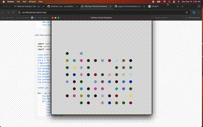

# Painting
The first step is to download an image with multiple colors.
The second method is to use the 'colorprogram' module to extract the different colors.
```Python
import colorgram

list_color = []
colors = colorgram.extract('image.jpg', 30)
for color in colors:
    r = color.rgb.r
    g = color.rgb.g
    b = color.rgb.b
    new_color = (r,g,b)
    list_color.append(new_color)
```
Let's now use the 'Turtle' module documentation to create the painting.

```python
import turtle as t
from turtle import Screen
import random

count_pent = 0
color_list = [(15, 20, 75), (131, 161, 199), (17, 41, 152), (59, 11, 37), (135, 95, 38), (55, 98, 146), (180, 167, 144), (172, 148, 45), (197, 213, 229), (163, 180, 228), (53, 113, 69), (142, 13, 41), (61, 34, 17), (93, 112, 188), (148, 181, 169), (133, 65, 104), (207, 230, 206), (180, 152, 166), (83, 88, 15), (18, 60, 37), (37, 89, 31), (60, 158, 145), (155, 22, 13), (203, 73, 143), (60, 154, 170), (232, 217, 223), (236, 220, 70), (159, 215, 167), (222, 167, 177)]
tim = t.Turtle()
t.bgcolor('#ddd')
t.colormode(255)
tim.setheading(225)
tim.penup()
tim.speed("fastest")
tim.forward(350)
tim.setheading(0)
tim.hideturtle()

number_dot = 100

for r_dot in range(1, number_dot +1):
    tim.dot(20, random.choice(color_list))
    tim.fd(50)
    if r_dot % 10 == 0:
        tim.setheading(90)
        tim.forward(50)
        tim.setheading(180)
        tim.forward(500)
        tim.setheading(0)
```

